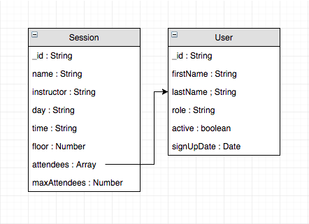

http://fitazfk-project.netlify.com/

## Table of Contents

- 350 word summary of your application including problem definition, solution.
- Review of the conceptual design with the client
- User stories.
- Wireframes.
- A workflow diagram of the user journey/s.
- Entity Relationship Diagram (ERD).
- Project plan and effort estimation.

## 350 Word Summary of Application

Overview:

FitazFK gym is a recently opened local business that opened its doors in late 2017 at 101 Main Street, Kangaroo Point.
As an up and coming small business, FitazFK doesn’t have a dedicated web development team.  Their current website was built using Wix, with elements embedded from Gym Master which is an external membership management system.
Having spoken to Aaron and Georgio (the owners) and members of FitazFK, the general consensus is that their website, and in particular their class booking system is clunky and painful to use.  Another issue that was raised is that the embedded Gym Master elements are uncustomizable and don’t flow with the other website elements.

Solution:

For our major project, our plan was to rebuild the FitazFK Gym website from the ground up using a NodeJS/Express back-end attached to a Mongo database, with a ReactJS front-end.  Our main focus was to build a user-friendly booking system for the gym’s fitness classes, but also to build a cleaner, more visually appealing website built to the clients specifications.
To make the app visually appealing, we decided to use to use the Semantic UI framework and do a complete overhaul of the site’s styling.
To build the class booking page, we scrapped the existing block button format of the embedded Gym Master components and chose a responsive table format.  The table shows the user one week of classes with all the relevant information - class name, instructor name, class size (with a live count of available spots) and a button to join the class.  Users can filter classes by day of the week, or can select which type of class to show via a dropdown.
Admin users have access to an admin dashboard, in which they have full CRUD for sessions and can view, edit or change a user to active or inactive.
The contact page has been re-styled and moved to its own page.  The embedded Google map has been upgraded from a static map to an interactive one.  The location marker has been placed in the correct spot and has has buttons to get directions and save the location.

## Client Interaction

Meeting 1:

https://docs.google.com/document/d/1bCrWrMEWA5iRrqAZl9cwilmjbMxzvoiJX2BbixZhcz8/edit?usp=sharing

Meeting 2:

https://docs.google.com/document/d/1dGXVO9oxS6955ThhMqlAhQ91mgyoQh621GVagtl0KY0/edit?usp=sharing

## User Stories

As a user I should be able to:
- Quickly see what the website is about.
- Quickly find information about what classes the gym offers.
- Quickly get the gyms contact info / location.
- Quickly see pictures of the gym.
- Easily signup to the gym.
- Easily login.
- Easily see the class timetable in a readable format.
- Easily signup to a class / leave a class.
- Easily see how many people in a class / the instructor of the class.
- Easily filter the timetable by day or by class.

As an admin I should be able to:

- Have full CRUD control of sessions.
- Have full CRUD control of users.
- Quickly see information about which users are in each class.
- Quickly be able to remove users from a class.

Frontend Trello Board:

https://trello.com/b/uroAcuWW/frontend

Backend Trello Board:

https://trello.com/b/gHKmd3kQ/backend

## Wireframes

Homepage:

Classes Table:

Gallery:

Contact:

Admin Classes:

## Workflow Diagram

## Entity Relationship Diagram

## Project Plan

Problem:

- Booking system UX is poor
- Embedded Gym Master elements not customisable
- Google Maps location marker incorrect
- Static Map
- Not fully responsive
- General Styling

Solution: 

- Booking system overhauled - change to  table format
- Re-style the whole site using Semantic UI React
- Contact page restyled and interactive map added
- Fully responsive
- Add a Class descriptions page

Timetable:

Budget:

