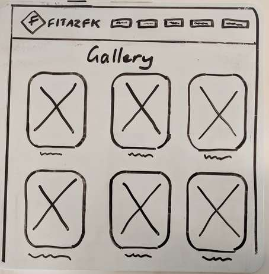

This project was bootstrapped with [Create React App](https://github.com/facebookincubator/create-react-app).

Below you will find some information on how to perform common tasks. 
You can find the most recent version of this guide [here](https://github.com/facebookincubator/create-react-app/blob/master/packages/react-scripts/template/README.md).

## Table of Contents

- 350 word summary of your application including problem definition, solution.
- Review of the conceptual design with the client
- User stories.
- Wireframes.
- A workflow diagram of the user journey/s.
- Entity Relationship Diagram (ERD).
- Project plan and effort estimation.

## 350 Word Summary of Application
adsf
## Review of the conceptual design with the client
asdf
## User Stories
asdf
## Wireframes

Homepage

Classes Table

Gallery

Contact

Admin Classes

## Workflow Diagram

## Entity Relationship Diagram

## Project Plan
